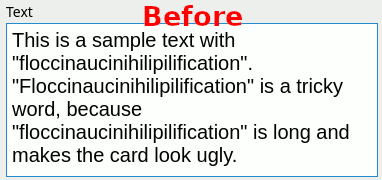

# Anki Word Hyphenator

An Anki plugin that hyphenates words during editing.

  

## Installation From Source

1. Run `package` from the main directory. This will create
   `wordhyphenator.ankiaddon`.
2. Import `wordhyphenator.ankiaddon` in Anki.
